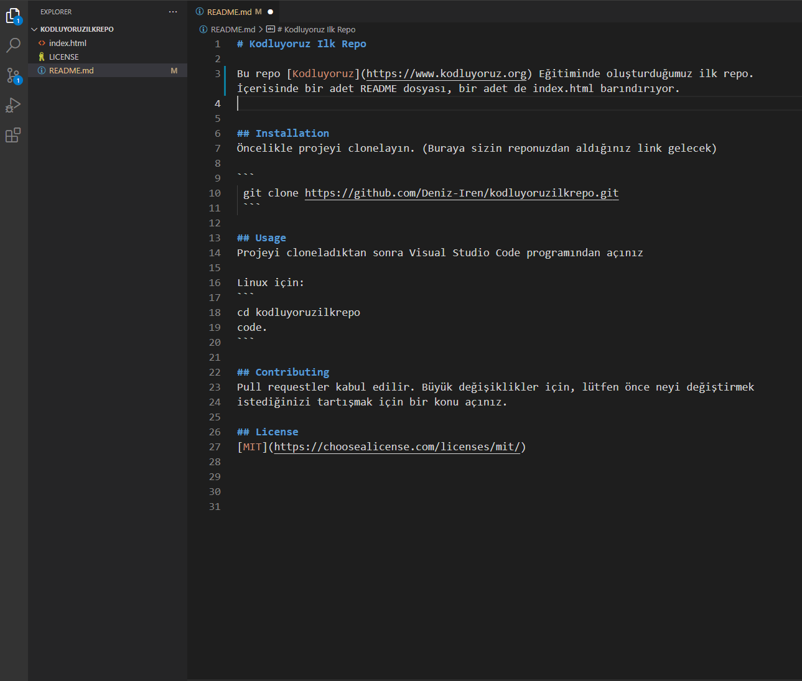

# Kodluyoruz Ilk Repo

Bu repo [Kodluyoruz](https://www.kodluyoruz.org) Eğitiminde oluşturduğumuz ilk repo. İçerisinde bir adet README dosyası, bir adet de index.html barındırıyor.


## Installation
Öncelikle projeyi clonelayın. (Buraya sizin reponuzdan aldığınız link gelecek)

```bash
 git clone https://github.com/Deniz-Iren/kodluyoruzilkrepo.git 
 ```  

## Usage
Projeyi cloneladıktan sonra Visual Studio Code programından açınız

Linux için:
```linux
cd kodluyoruzilkrepo
code .
```

## Contributing 
Pull requestler kabul edilir. Büyük değişiklikler için, lütfen önce neyi değiştirmek 
istediğinizi tartışmak için bir konu açınız.

## License
[MIT](https://choosealicense.com/licenses/mit/)


